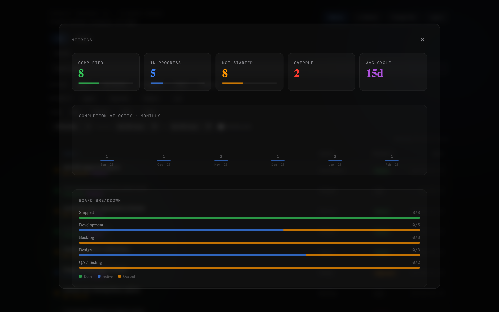
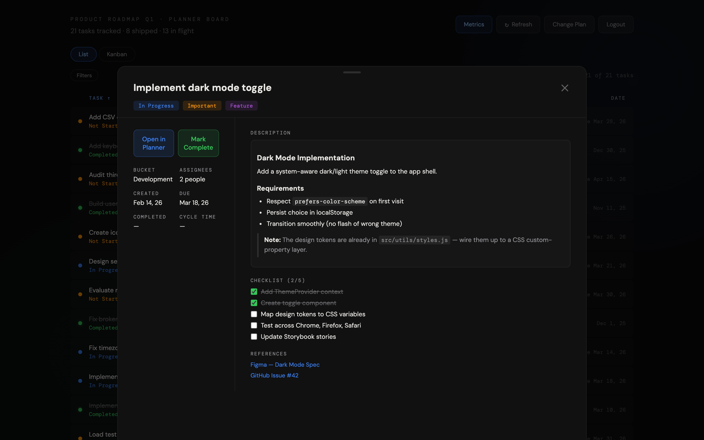
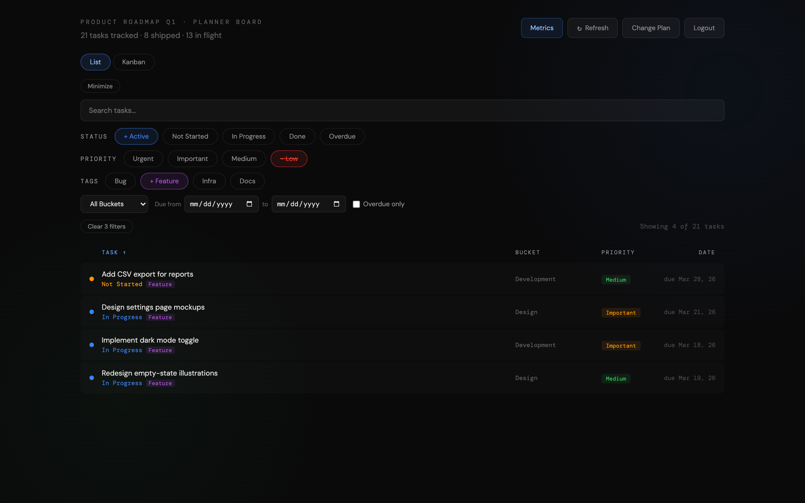
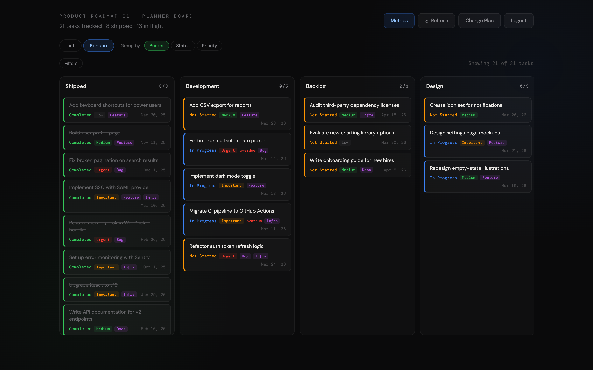

# plan-b

Because Planner was never plan A.

A dashboard that makes Microsoft Planner data actually useful — built with React, Vite, and spite.

## Screenshots

| Metrics | Task Detail |
|---------|-------------|
|  |  |
| **List View** | **Kanban Board** |
|  |  |

> Try it yourself: `npm run dev` then open `http://localhost:5173/?demo`

## Run it

```bash
docker compose up -d
```

Open `http://localhost:3000`, grab a token from [Graph Explorer](https://developer.microsoft.com/en-us/graph/graph-explorer), paste it in, done. Tokens expire after ~1 hour — just paste a new one.

To update: `docker compose pull && docker compose up -d`

## MSAL setup (optional, for persistent sign-in)

To get a "Sign in with Microsoft" button instead of pasting tokens:

1. Register an app in Azure AD with `Tasks.Read`, `Tasks.Read.Shared`, `Group.Read.All`, `User.Read` permissions
2. Uncomment and fill in the `environment` section in `docker-compose.yml`
3. `docker compose up -d`

## Development

```bash
cp .env.example .env  # fill in Azure AD IDs if using MSAL
npm install && npm run dev
```
